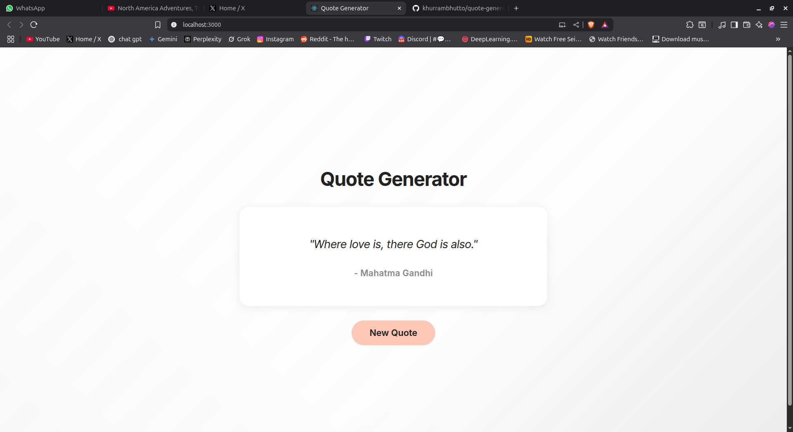

# Quote Generator

A beautiful, Notion-inspired quote generator built with React. Fetches random quotes from the [API Ninjas Quotes API](https://api-ninjas.com/api/quotes) and displays them in a clean, modern UI.

## Features
- Fetches random quotes from a public API
- Notion-inspired, minimal design
- Responsive and mobile-friendly
- Secure API key management using environment variables

## Demo
 <!-- Add a screenshot if you wish -->

## Getting Started

### 1. Clone the repository
```bash
git clone https://github.com/your-username/quote-generator.git
cd quote-generator
```

### 2. Install dependencies
```bash
npm install
```

### 3. Set up your API key
This project uses the [API Ninjas Quotes API](https://api-ninjas.com/api/quotes). Sign up for a free API key.

Create a `.env` file in the project root:
```
REACT_APP_API_NINJAS_KEY=your_api_key_here
```
**Do not commit your `.env` file to GitHub!**

### 4. Start the development server
```bash
npm start
```
Open [http://localhost:3000](http://localhost:3000) to view it in your browser.

## Deployment
Build the app for production:
```bash
npm run build
```

## License
MIT
